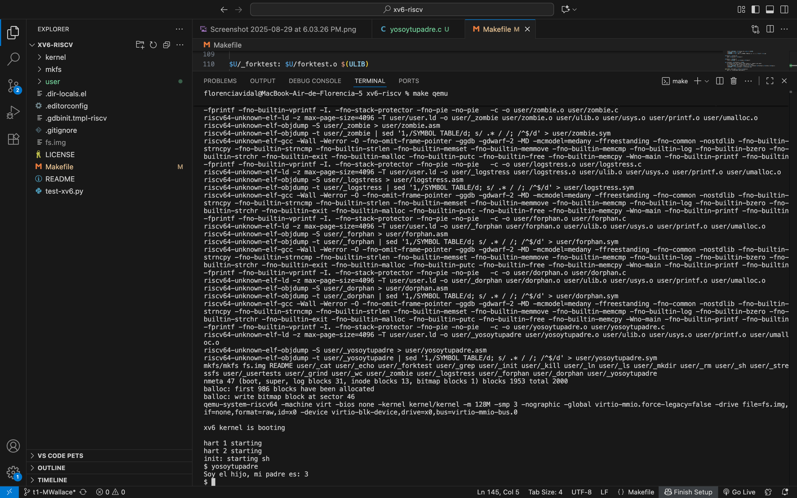

# INFORME T1 – Nueva llamada al sistema `getppid()`

## 1. Explicación de lo implementado
Se implementó una nueva llamada al sistema en xv6 llamada `getppid()`.  
Esta syscall permite obtener el PID (Process ID) del proceso padre de aquel que la invoca.  
La implementación se basó en el patrón existente de `getpid()`.

## 2. Archivos modificados
- **kernel/syscall.h** → Se agregó la constante `SYS_getppid` con un nuevo número de syscall.
- **kernel/sysproc.c** → Se implementó la función `sys_getppid()` que retorna el PID del proceso padre.
- **kernel/syscall.c** → Se declaró `extern sys_getppid()` y se registró en la tabla `syscalls[]`.
- **user/user.h** → Se agregó el prototipo `int getppid(void);`.
- **user/usys.pl** → Se añadió `entry("getppid");` para generar el stub de la syscall.
- **user/yosoytupadre.c** → Nuevo programa de usuario para probar la syscall.
- **Makefile** → Se incluyó `$U/_yosoytupadre\` en `UPROGS` para compilar y cargar el programa en xv6.

## 3. Dificultades y soluciones
- **Numeración de syscalls**: fue necesario revisar el último número usado en `syscall.h` para asignar correctamente `SYS_getppid`.
- **Prueba en xv6**: al principio costó diferenciar entre los comandos que se ejecutan dentro de xv6 y los que deben hacerse en macOS, pero se solucionó separando bien los entornos.
- **Compilación larga en M1**: la primera instalación de toolchains tomó bastante tiempo, pero luego el proceso de compilación fue fluido.

## 4. Pruebas realizadas
Se creó el programa `yosoytupadre.c`, que ejecuta un `fork()`.  
- El hijo llama a `getppid()` y muestra en pantalla el PID de su padre.  
- El padre espera a que termine el hijo.  

## 5. Evidencia

Se adjunta captura de pantalla mostrando la ejecución del programa `yosoytupadre` dentro de xv6.  
La evidencia se encuentra en: `docs/yosoytupadre-ok.png`.

Salida observada dentro de xv6:

$ yosoytupadre
Soy el hijo, mi padre es: 3
