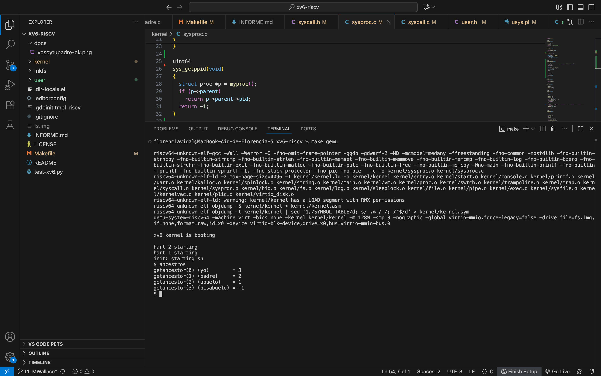

# INFORME T1 — Llamadas al sistema `getppid()` y `getancestor(int)`

## 1. Explicación de lo implementado
Se implementaron dos llamadas al sistema en xv6:

- `getppid()`: retorna el PID del **proceso padre** del proceso que la invoca (análoga a `getpid()`).
- `getancestor(int n)`: retorna el PID del **n-ésimo ancestro** del proceso que la invoca.  
  - `n = 0` → el mismo proceso  
  - `n = 1` → su padre  
  - `n = 2` → su abuelo  
  - Si `n < 0` o se pide más arriba de la raíz (`init`), retorna **-1**.

## 2. Archivos modificados
- **kernel/syscall.h** → se agregaron `SYS_getppid` y `SYS_getancestor`.
- **kernel/sysproc.c** → implementación de `sys_getppid()` y `sys_getancestor()`:
  - `sys_getppid()` retorna `myproc()->parent->pid` (o `-1` si no existe).
  - `sys_getancestor()` navega por `p->parent` hasta `n` niveles; retorna `-1` si `n` no es válido o no hay más ancestros.
- **kernel/syscall.c** → `extern` de ambas funciones y registro en la tabla `syscalls[]`.
- **user/user.h** → prototipos `int getppid(void);` y `int getancestor(int n);`.
- **user/usys.pl** → generación de stubs: `entry("getppid");` y `entry("getancestor");`.
- **user/yosoytupadre.c** → programa de prueba para `getppid()`.
- **user/ancestros.c** → programa de prueba para `getancestor(int)`.
- **Makefile** → agregados a `UPROGS`:  
  ` $U/_yosoytupadre\` y ` $U/_ancestros\`.

## 3. Dificultades y soluciones
- **Lectura de argumentos en syscalls**: usar correctamente `argint(0, &n)` en `sys_getancestor()` y validar `n < 0`.  
- **Diferenciar contextos (host vs xv6)**: separar los comandos que se ejecutan en macOS (`make qemu`) de los que corren **dentro de xv6** (`yosoytupadre`, `ancestros`).  
- **Orden y tabla de syscalls**: asegurar `extern` + entrada en `syscalls[]` con el **número correcto** en `syscall.h`.

## 4. Pruebas realizadas — `getppid()`
Se creó el programa `yosoytupadre.c`, que ejecuta un `fork()`:
- El **hijo** llama a `getppid()` y muestra el PID de su **padre**.
- El **padre** espera a que termine el hijo con `wait(0)`.

## 5. Evidencia (getppid)
Se adjunta captura en `docs/yosoytupadre-ok.png`.


## 6. Pruebas con `getancestor(int n)`
Se creó `ancestros.c` para verificar distintos niveles.

Evidencia gráfica: `docs/ancestros-ok.png`.



## 7. Cumplimiento de la tarea (resumen breve)
- **Parte I (obligatoria)**: `getppid()` implementada y probada con `yosoytupadre.c` ✅  
- **Parte II (optativa)**: `getancestor(int)` implementada y probada con `ancestros.c` ✅  
Ambas funcionalidades compilan, ejecutan correctamente y tienen evidencia en `docs/`.

## 8. Cómo compilar y ejecutar
```bash
make clean && make qemu
# dentro de xv6:
$ yosoytupadre
$ ancestros
